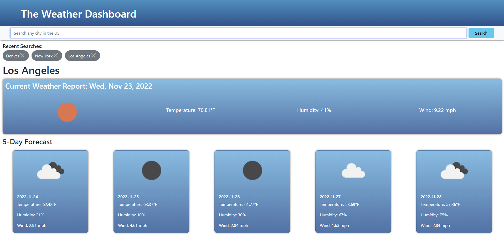

# Weather-Dashboard

## Description
A Weather Dashboard that displays current weather and 5-day forecast for any city in the US.

## Installation
Launch this site using any browser via the following link: https://monysary.github.io/Weather-Dashboard/

## Usage
This website features temperature, humidity, and wind speed weather data for cities in the US. When the user searches a city, weather data populates for the current day and the following 5 days. User's searches are stored in local storage and their searches are populated under the Recent Searches section. Users can navigate to view weather data by clicking on their recently searched city as well. Clicking the X next to the city will remove that specific city from Recent Searches and local storage.

This webpage features a dynamically adapts to different screen sizing when viewing on different devices.

## Credits
Styling made using Bootstrap

## License
N/A